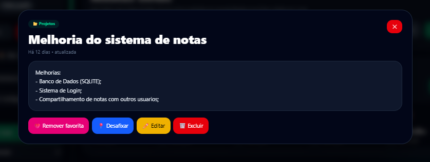

# Smart Notes 1.4.4

Aplicativo de notas privadas e compartilhadas, com backend Node.js/SQLite, frontend React para computador e aplicativo Android offline com Capacitor.

## Estrutura

```text
.github/workflows/   geração do APK Debug
backend/             API Node.js e SQLite
frontend/            interface para computador
mobile-app/          aplicativo Android offline
scripts/mobile/      versão, segurança e ícones Android
docs/screenshots/    imagens deste README
```

## Funcionalidades

- Login por usuário ou e-mail;
- nome de exibição separado do nome de usuário;
- cadastro, perfil e administração de usuários;
- notas privadas, públicas e protegidas por senha;
- categorias, subcategorias, favoritas, fixadas, imagens, observações e lixeira;
- temas claro e escuro;
- exportação e importação do banco;
- backup automático interno;
- identidade visual e ícones Android do Smart Notes 1.4.4.

## Experiência de uso

- Listagem de notas sem os cartões de categorias no topo;
- filtro de categorias e subcategorias aberto pelo botão **Filtrar**;
- visualizador de imagens com download;
- edição e exclusão de subcategorias restritas ao administrador;
- tratamento do botão físico **Voltar** no Android para fechar a interface aberta antes de minimizar o aplicativo.

## Executar para desenvolvimento

### Backend

```bash
cd backend
npm install
npm start
```

### Frontend

```bash
cd frontend
npm install
npm run dev
```

A interface fica em `http://localhost:5173` e o backend em `http://localhost:3000`.

## Gerar APK Debug

No GitHub, abra **Actions** e execute o workflow **Gerar APK Debug - Smart Notes 1.4.4**. O artefato gerado contém o APK para instalação.

## Capturas

### Tela inicial


### Detalhes de uma nota



## Segurança do repositório

O `.gitignore` exclui bancos pessoais, backups, `node_modules`, builds, chaves e arquivos temporários.

## Autor

Desenvolvido por **Luan Claiver**.
